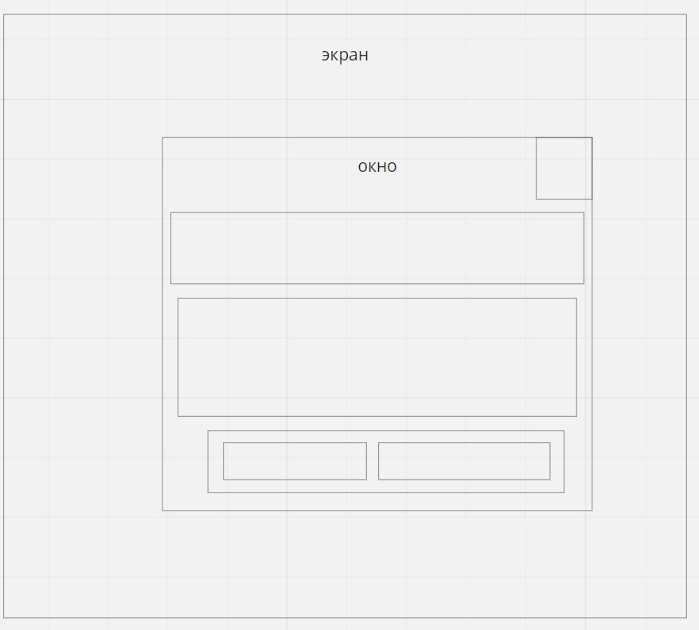
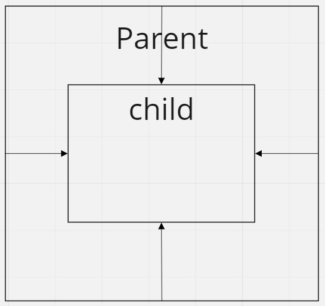
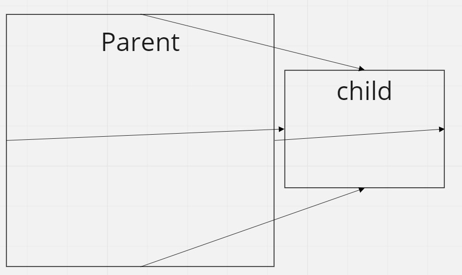
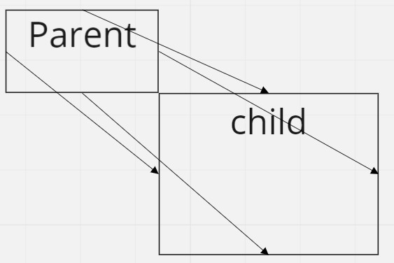

# Плавающая верстка
#### версия 1.0

## Общие положения
Подход предполагает что все основные игровые действия происходят в квадрате вписанном в текущее разрешение экрана.
Весь незначительный ui жмется по краям этой области, а значимый занимет главенствующее положение по середине. 
Например кнопка "закрыть" может находиться в правом верхнем углу и занимать незначительное место,
а окно "магазина" открывается по центру и занимает как можно больше места.

Непосредственно верстка отделена от визуальных "виджетов", и только сообщает им текущие размеры.
Это позволит в будущем добавить анимации появления/пропадания, реакций на нажатия и пр.

### Камера и fov
Из за изменения пропорций экрана в первую очередь надо озаботится тем что видно из игровой сцены.
Для этого создан специальный класс перерасчета fov что бы гарантировано видеть определенный размер
игрового поля.

В примере начальное положение камеры {0,0,-10}. При начальном горизонтальном fov 60 градусов
мы гарантируем что кубы расположенные в {-5,0,0} и {5,0,0} всегда будут в экране.
Для вычислений в примере есть еще кубы расположенные {0,5,0} и {0,-5,0} при вертикальном fov 60
их так же гарантировано видно.
Если у вас другое начальное положение камеры то лучше его подогнать так что бы мы гарантировано
видели нужные объекты на фов 60.

Остальные кубы нужны что бы показать больше сцены при разных аспектах сильно отличных от 1.

### AdaptiveFov
В любой момент времени можно у него спросить текущий адаптируемые fov исходя из размеров видимой
области. Но лучше всего делать это на onResize и там же выставлять требуемый fov.

### UiRect - основа основ.

UiRect специальный класс которому можно задать правила наследования размеров rect от родительского
и он пересчитает свои размеры и выравнивание.

* left - отступ левой границы
* right - отступ правой границы
* top - отступ верхней границы
* bottom - отступ нижней границы

Это древовидная структура, в главный uiRect вложенны подчиненные, а внутрь них еще, и так далее.
Верстка заключается в том что бы нарезать регионы от большего к подчиненному меньшему.

#### Точки привязки (PivotAt)
Для left-right границы имеют смысл 3 точки привязки

* center - от середины родительского UiRect ( в плюс направо, в минус налево)
* left - от левой границы родителя ( вплюс направо, в минус налево)
* right - от правой границы родителя ( вплаю налево, в минус направо)

Для top-bottom границы имеют смысл 3 точки привязки

* center - от середины родителя ( в плюс вверх, в минус вниз)
* top - от верхней границы родителя ( в плюс вниз, в минус вверх )
* bottom - от нижней границы родителя ( в плюс вверх, в минус вниз )

Значение отступов (OffsetType) задаются в 2 вариантах

* проценты ( PERCENT ) - в размерах родителя
* единицы ( POINTS ) - для мировых это метры, для dom это пиксели.

Для выравнивания есть несколько опций - заполнение и выравнивание
#### Заполнение (FillType)

* игнорирем аспект () - uiRect займет все место ограниченное отступами.
* вписанный по высоте - будет вписан в так что бы занимать всю высоту с учетом аспекта
* вписанный по ширине  - будет вписан в так что бы занимать всю ширину с учетом аспекта
* вписанный - рамзмер будет подогнан под аспект что бы не выходть за границы 
* описанный - размер будет подогнан под аспект так что бы накрыть собой границы

#### Выравнивание (HorizontalAlign, VericalAlign)
Выравнивание имеет смысл при заполении отличном от игнорирующих аспект или если оступы заданы в points.
Например если у нас uiRect заполняет родительский по ширине, но мы не хотим что бы он вылезал
за границы родителя снизу, в таком случае надо задать FillType::FIT_HORIZONTAL, желаемый аспект
и VerticalAlign::Bottom.

### Примеры верстки

Обычная верстка

Необычная верстка

Очень необычная верстка

## Варианты

Так как uiRect это всего лишь математика и правила то она может считать любые варианты координатных
систем, например в 3d мире в метрах, а в dom html пиксели.

В проекте сейчас есть 2 специальных базовых класса для облегчения манипулирования объектами в понимании ui.
WorldUi и DomUi.

Предполагается что программист отнаследуется от них и в абстрактном методе initContent создаст
необходимые ему "виджеты" и забиндит нужные каллбеки что бы обрабатывать события от "виджетов"
снаружи. Так же в наследниках можно реализовывать недостающий но необходимый функционал.

Для корректной работы WorldUi и DomUi наследники должны получать вызов updateSize при изменении
размеров отображаемой области. 

### World - ui в 3д мире

Главной особенностью данного варинта верстки является то что физически "виджеты" находяться в
3d сцене и могут пересекаться с другими объектами. Так что следует за этим внимательно следить что бы
избежать ненужных пересечений.

Для экземпляра можно задать рутовую ноду в которую будут добавляться "виджеты" и указать дальность
от камеры где ее требуется рассчитывать. В примере рутовой нодой выступает Render::root. Что
означает - перемещение камеры оставят ui на прежнем месте. Для того что бы перемещать камеру
и ui оставался на прежнем месте экрана надо сделать дополнительную ноду и добавить ее в иерархию
камеры. Так же следует учитывать что по умолчанию камера не присутствует в сцене, все что
будет добавлено в камеру отрисовываться не будет, пока камеру вручную не добавишь в сцену.

Координатная система стандартная для 3d мира

* +X направо
* -Х налево
* +Y вверх
* -Y вниз

Из за особенностей отрисовки для корректного блендинга прозрачных объектов нам требуется
четко знать какой renderOrder ставить конкретному объекту. 
Для этого применяется 3 механизма

* Объекты на сцену добавлются с небольшим отступом по Z
* Чем больше у объекта order тем ближе он ставится к камере 
* У каждого экземпляра WorldUi можно задать общий order для всех объектов: т.е. можно самостоятельно разнести несколько ui по глубине.

Требуется внимательно следить за порядком "виджетов", если вы поставите одинаковый порядок у большого
"виджета" он легко может скрыть за собой меньшй "виджет".

Сейчас в WorldUi "виджетах" используется стантартный sprite.mat. В следующих версиях планируется добавть
slice9sprite.mat.

### Dom - ui в html dom

Даннный класс кеширует при старте виртуальное разрешение gui так что менять в процессе его не надо.
При тестировании следует учитывать то что инспектор в хроме ломает обновление размеров dom ui. Так
что желательно смотреть верстку с выключеными отладочными инструментами.

Координатная система приведена в соответствие с мировой

* +X направо
* -Х налево
* +Y вверх
* -Y вниз

## Ресурсы

Так как оба подхода к верстке используют графические ресурсы (png, jpg) следует учитывать 
особенности автодобавления подобных ресурсов в AssetCreator.config.

По умолчанию новые найденные ресурсы добавляются в defauil.w4a секцию и будут доступны
только для WorldUi "виджетов". Для того что бы ресурс стал доступен для DomUi его описание надо
перенести в секцию "pass". Один и тот же ресурс не может быть одновременно в нескольких
секциях, что следует учитывать при проектировании ui. Дублировать ресурс под разными путями
можно, но не приветствуется т.к. увеличивает финальный вес сборки.
